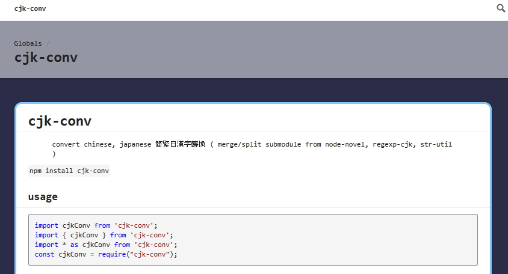

# typedoc-themes-color

    Add little color for Default themes by TypeDoc.


```
typedoc --options ./typedoc.config.js
```

typedoc.config.js
```ts
const path = require('path');

let p = path.resolve(path.join(path.dirname(require.resolve('typedoc-themes-color')), 'theme'));

console.log(p);
console.log(path.relative(process.cwd(), p));

module.exports = {
	src : '.',
	out: './docs',
	//theme: './my-theme',
//	theme: path.relative(process.cwd(), p),
	theme: p,
	ignoreCompilerErrors: true,
	excludeExternals: true,

	externalPattern: "**/node_modules/**/*",

	mode: "modules",

	exclude: [
		"test",
		"node_modules",
		"test/",
		"node_modules/",
		"**/test",
		"**/node_modules",
		"**/test/**/*",
		"**/node_modules/**/*",
	],
};

console.log(module.exports);

```

## screenshots


